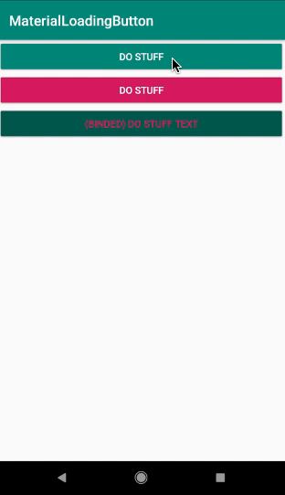

# MaterialLoadingButton

A **configurable** and **animated** material loading button. If you're an RxJava fan as I am this button will come you really handy.



## Usage

Minimum SDK: 21 

Currently this widget is running with androidX and also allows the usage of databinding to set the elements comfortably.

### Gradle
```
allprojects {
  repositories {
    maven { url 'https://jitpack.io' }
  }
}
```
```
dependencies {
	implementation 'com.github.Muki1992:MaterialLoadingButton:1.4'
 }
```
### Indicating the loading progress
```
fun doStuff(view: View) {
    loadingButton.onStartLoading()
    Handler().postDelayed({
    loadingButton.onStopLoading()
    }, 500)
}
```
### XML
```xml
<de.mustafagercek.library.LoadingButton
     android:id="@+id/loading_button"
     android:layout_width="match_parent"
     android:layout_height="wrap_content"
     app:buttonText="Do stuff"
     app:onButtonClick="@{(view)->presenter.doStuff(view)}"
     bind:buttonColor="@{@color/colorPrimary}"/>
```

#### Accessing attributes programatically
All custom attributes can be set like below:
```
loadingButton.setButtonOnClickListener(View.OnClickListener)

loadingButton.setButtonColor(Int)

loadingButton.setTextColor(Int)

loadingButton.setButtonText(String)
```

## License


Copyright 2019 Mustafa Gercek

Licensed under the Apache License, Version 2.0 (the "License");
you may not use this file except in compliance with the License.
You may obtain a copy of the License at

    http://www.apache.org/licenses/LICENSE-2.0

Unless required by applicable law or agreed to in writing, software
distributed under the License is distributed on an "AS IS" BASIS,
WITHOUT WARRANTIES OR CONDITIONS OF ANY KIND, either express or implied.
See the License for the specific language governing permissions and
limitations under the License.
```
